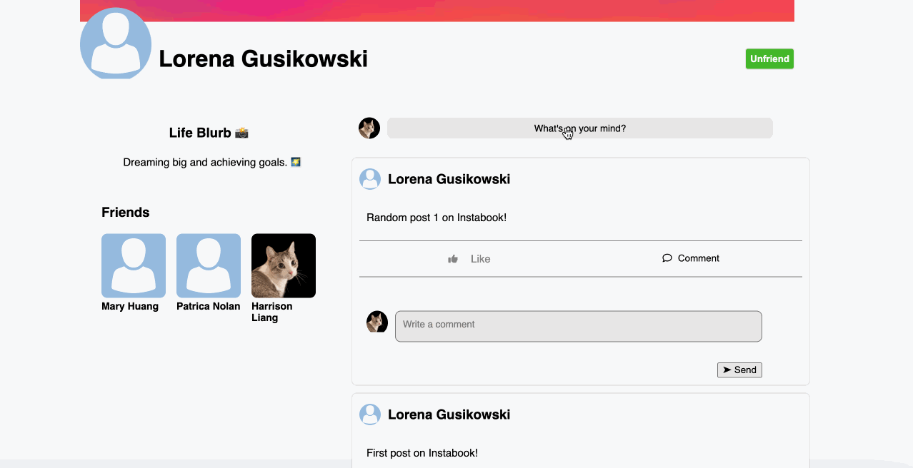
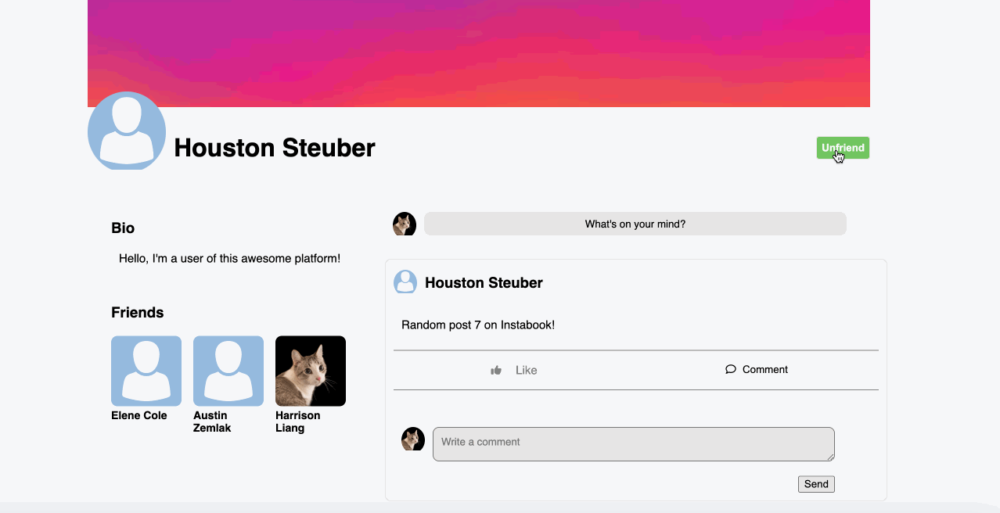
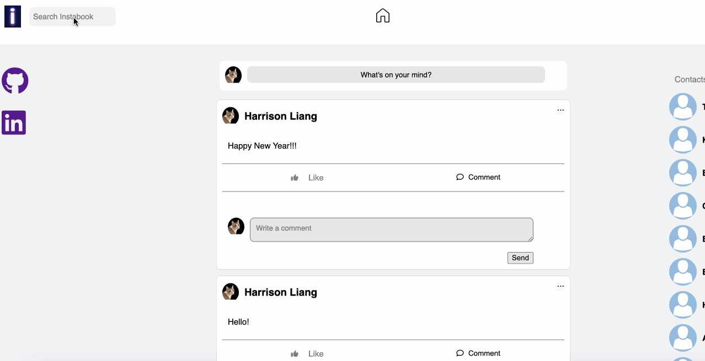

# Instabook

[Instabook](https://instabook-clone.onrender.com/) is a Facebook clone where users can create accounts, login, post, comment, like, and go to each others' walls.

## Technologies Used

This project uses React, Redux, Ruby on Rails, AWS S3, and PostgresSQL. It is hosted using Render.

## Main Features

### Logging in:


### Signing Up:


### Posting: Users can post on the newsfeed or other users' walls. Users can optionally attach images to their posts. Lastly, users can edit and delete their own posts.



### Commenting and Liking: Users can like posts and comments. Users can also edit and delete their own comments.


### Friending: Users can friend and unfriend other users.



### Searching: Users can search each other.



## Code Snippets

### Going to a user's profile:

The user's profile really gave me insight on thinking about components, which is what React is all about.

```
<div id="profile-page">
    <div id="cover-photo">
        
    </div>

    <div id="profile-info-and-friend">
        <div id="profile-info-container">
            <div id="profile-pic">
                
            </div>
            <div id="profile-info">
                <h1>{`${user?.firstName} ${user?.lastName}`}</h1>
            </div>
        </div>

        <div>
            {currentUser && currentUser.id != userId && (
                <>
                    {user?.friendIds?.includes(currentUser.id) ? (
                        <button onClick={handleUnFriend} className='friendButton'>Unfriend</button>
                    ) : (
                        <button onClick={handleFriend} className='friendButton'>Friend</button>
                    )}
                </>
            )}
        </div>
    </div>


    <div id="profile-container">
        <div id="profile-left">
            <div id="bio">
                <h3>Life Blurb 📸</h3>
                <p>{`${user?.bio}`}</p>
            </div>
            <div id="profile-friends-list">
                <FriendsList />
            </div>
        </div>
        <div id="profile-right">
            <MakePostsModal feedId={userId}/>
            <AllPosts posts={userPosts}/>
        </div>
    </div>
    <div className="clearfix"></div>
</div>
```

### Posts Reducer:

This was quite challenging because comments affect the posts.

```
const postsReducer = (state = {}, action) => {
    const newState = {...state};

    switch(action.type){
        case RECEIVE_POSTS:
            return {...newState, ...action.posts};
        case RECEIVE_POST:
            return {...newState, [action.post.id]: action.post};
        case REMOVE_POST:
            delete newState[action.postId];
            return newState;
        case RECEIVE_COMMENT:
            let post = state[action.comment.postId];
            let commentIds = post.commentIds;
            let newCommendIds = commentIds.includes(action.comment.id) ? commentIds : [action.comment.id, ...commentIds]
            let newPost = {
                ...post,
                commentIds: newCommendIds
            };
            return {...newState, [action.comment.postId]: newPost};
        case REMOVE_COMMENT:
            let removedCommentPost = state[action.comment.post_id];
            let removedPostCommentIds = [...(removedCommentPost.commentIds)];
            let updatedPost = {
                ...removedCommentPost,
                commentIds: removedPostCommentIds.filter(ele => ele != action.comment.post_id)
            };
            return {...newState, [action.comment.post_id]: updatedPost};            
        default:
            return state;
    }
}
```