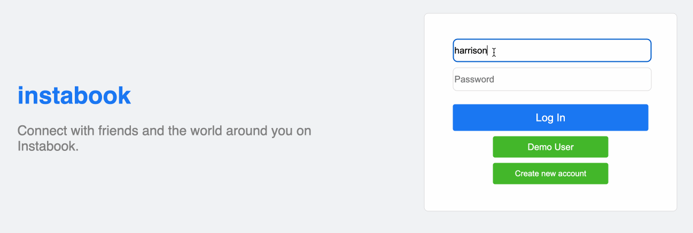
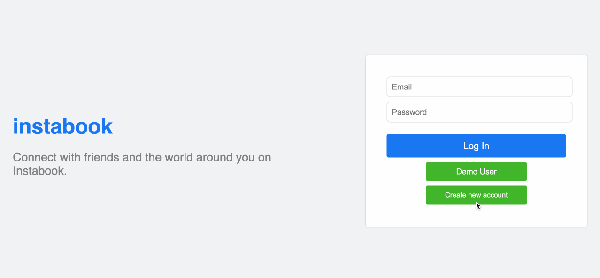
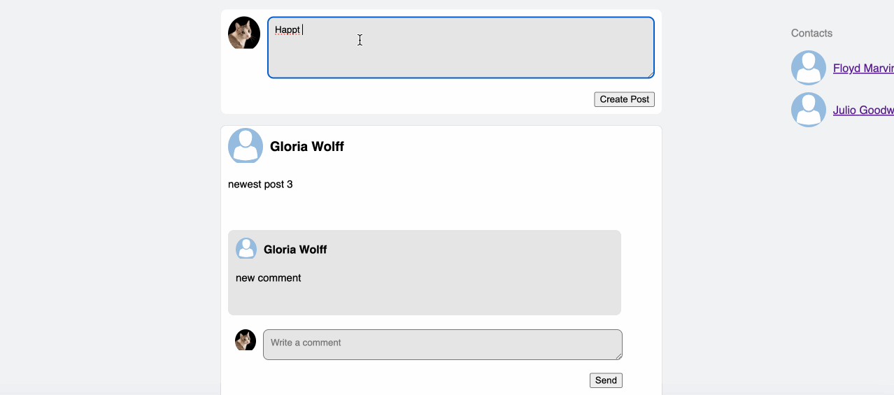
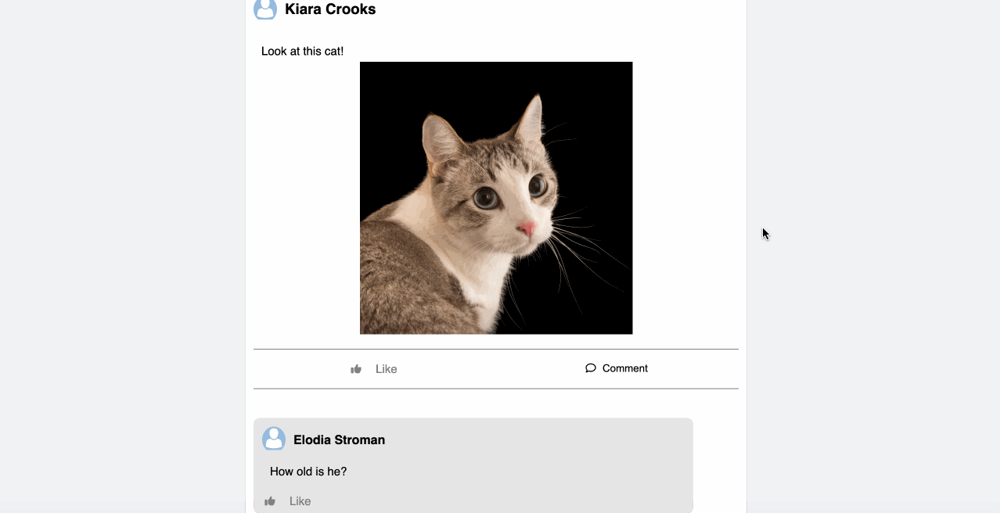

# Instabook

[Instabook](https://instabook-x26u.onrender.com) is a Facebook clone where users can create accounts, login, post, comment, and go to each others' walls.

## Technologies Used

This project uses React, Redux, Ruby on Rails, AWS S3, and PostgresSQL. It is hosted using Render.

## Main Features

### Logging in:



### Signing Up:



### Posting: Users can create a post. Additionally, users can edit and delete their own posts.



### Commenting: Users can comment on posts. Additionally, users can edit and delete their own comments.



## Code Snippets

### Making a Post:

This was the first feature I implemented. It happened to be a full CRUD feature so I learned a lot from it. By doing this, it gave me the blueprint to do the other features in a more efficient manner.

```
function MakePosts() {
    const dispatch = useDispatch();
    const currentUser = useSelector((state) => state.session.user);
    const userId = currentUser?.id
    const user = useSelector(getUser(userId))


    const [body, setBody] = useState("");

    function changeBody(e) {
        setBody(e.target.value);
    }

    function handleSubmit(e) {
        e.preventDefault();

        setBody("");
        dispatch(createPost({body}));
    }

    return(
        <div id="make-post">
            <div className="post-profile-pic">
                
            </div>
            <form onSubmit={handleSubmit} >
                <label>
                    <textarea onChange={changeBody} value={body} placeholder="What's on your mind?" id="text-area-post"></textarea>
                </label>

                <div id="create-post-button">
                    <input type="submit" value="Create Post" />
                </div>
            </form>
        </div>
    )
}
```

### Going to a user's profile:

The user's profile really gave me insight on thinking about components, which is what React is all about.

```
const ProfilePage = () => {
    const dispatch = useDispatch();
    const { userId } = useParams();
    const user = useSelector(getUser(userId));
    
    useEffect(() => {
        dispatch(fetchUser(userId));
    }, [userId]);

    return (
        <div id="profile-page">
            <div id="cover-photo">
                
            </div>
            <div id="profile-info-container">
                <div id="profile-pic">
                    
                </div>
                <div id="profile-info">
                    <h1>{`${user?.firstName} ${user?.lastName}`}</h1>
                </div>
            </div>
            <div id="profile-container">
                <div id="profile-left">
                    <div id="bio">
                        <h3>Bio will be here</h3>
                    </div>
                    <div id="profile-friends-list">
                        <FriendsList />
                    </div>
                </div>
                <div id="profile-right">
                    <MakePosts />
                    <AllPosts />
                </div>
            </div>
            <div className="clearfix"></div>
        </div>
    )
}
```

### Posts Reducer:

This was very challenging because comments affect the posts. Thankfully, my instructor Steve is extremely knowledgeable and guided me through this.

```
const postsReducer = (state = {}, action) => {
    const newState = {...state};

    switch(action.type){
        case RECEIVE_POSTS:
            return {...newState, ...action.posts};
        case RECEIVE_POST:
            return {...newState, [action.post.id]: action.post};
        case REMOVE_POST:
            delete newState[action.postId];
            return newState;
        case RECEIVE_COMMENT:
            let post = state[action.comment.postId];
            let commentIds = post.commentIds;
            let newCommendIds = commentIds.includes(action.comment.id) ? commentIds : [action.comment.id, ...commentIds]
            let newPost = {
                ...post,
                commentIds: newCommendIds
            };
            return {...newState, [action.comment.postId]: newPost};
        case REMOVE_COMMENT:
            let removedCommentPost = state[action.comment.post_id];
            let removedPostCommentIds = [...(removedCommentPost.commentIds)];
            let updatedPost = {
                ...removedCommentPost,
                commentIds: removedPostCommentIds.filter(ele => ele != action.comment.post_id)
            };
            return {...newState, [action.comment.post_id]: updatedPost};            
        default:
            return state;
    }
}
```

## Future Implementation

+ Likes feature for posts and comments.

+ Friending feature for users. Although users have friends by default, I'd like them to be able to add and remove each other.

+ Uploading pictures to Instabook for posts, profile pictures, and cover photos.

+ Work on styling.